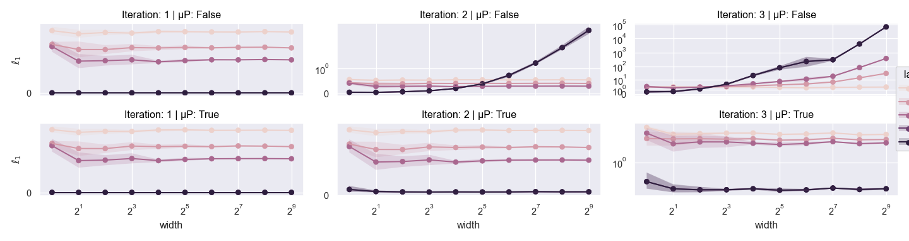
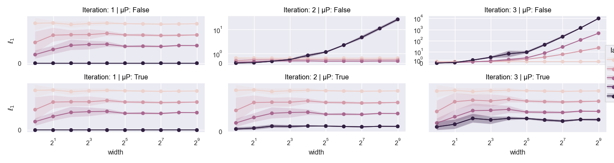
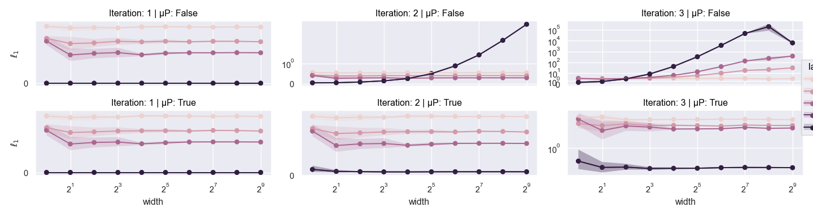
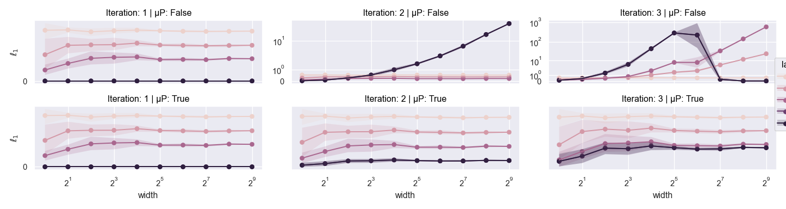

# Flax Maximal Update Parametrization (μP)

This is an implementation of the [Maximal Update Parametrization (μP)](https://arxiv.org/abs/2203.03466)
in Flax.

To train with μP there are two steps:
1. Create a Flax module that subclasses `mup.Module` instead of the regular linen `nn.Module`.
2. Chain the μP Optax transformation `scale_adam_by_mup` or `scale_sgd_by_mup` with your current optimizer.

For example,

```py
import jax
import jax.numpy as jnp
from flax import linen as nn
import flax_mup as mup
import optax

class Model(mup.Module):

    @nn.compact
    def __call__(self, x: jax.Array) -> jax.Array:
        # width is exposed from `mup.Module`
        x = nn.Dense(128 * self.width)(x)
        x = nn.relu(x)
        x = nn.Dense(128 * self.width)(x)
        x = nn.relu(x)
        x = nn.Dense(10)(x)
        return x

# Create your model specifying the target width with the width field.
model = Model(width=16)

# Initialize the model and optionally specify the base model width.
# It defaults to 1 but you can specify any integer value less than the
# target width above.
params = model.init(
    jax.random.PRNGKey(0),
    jnp.zeros((16)),
    base_width=1, # `base_width` defaults to 1
)

optim = optax.chain(
    optax.adam(learning_rate=1e-4),
    mup.scale_adam_by_mup(),
)
```

## Getting Started

The library is not published on PyPi, you can instead install it from GitHub:

```sh
# with pip
pip install git+https://github.com/jessefarebro/flax-mup

# with pdm
pdm add git+https://github.com/jessefarebro/flax-mup
```

##  Assumptions

1. The weights of the model are initialized from a distribution that's scale invariant,
    i.e., let X be a random variable and define $Y = X / c$ where $c$ is a non-zero constant.
    The property $\text{Var}[Y] = \text{Var}[X] / c^2$ must hold. This is the case for most initialization
    schemes that draw from either a uniform or gaussian distribution.
2. The learning rate scaling is the last transformation in the optimizer chain. Both the `scale_adam_by_mup`
    and `scale_sgd_by_mup` transformations assume this. For any standard Optax optimizer this should be the case.


## Coordinate Checks

Provided are coordinate checks to verify the implementation for various loss functions using MLPs & CNNs.
Transformers are currently untested but support should be fairly straightforward.

### Cross-Entropy MLP



### Cross-Entropy CNN



### L2 Regression MLP



### L2 Regression CNN


